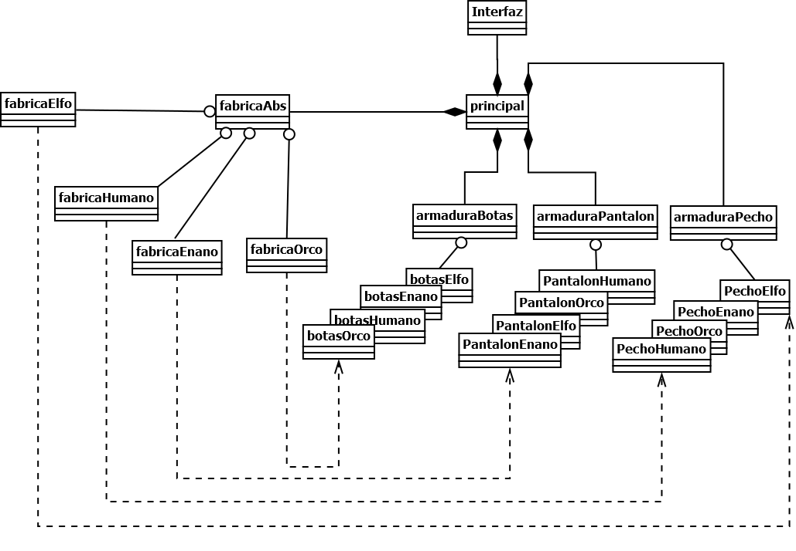

# Ejercicio Patrones Creacionales

Se requiere un ejemplo que algunos de los patrones creacionales

Consiste en armar personajes a partir del tipo, el programa se encarga de entregarle las partes al cliente atravez de una fabrica.

## Patrones Utilizados

* Abstract Factory
* Prototype

### Abstract Factory

Al momento de crear una fabrica abstracta que le entrega al cliente las partes correctas a partir del tipo que selecciona.

###

Al clonar el objeto creado en el cliente para mandarlo a la interfaz grafica para que cada objeto se dibujara las veces solicitadas.

## Diagrama UML

# Presentado por:

* Willmar Fabian Pelaez - 20182020123

